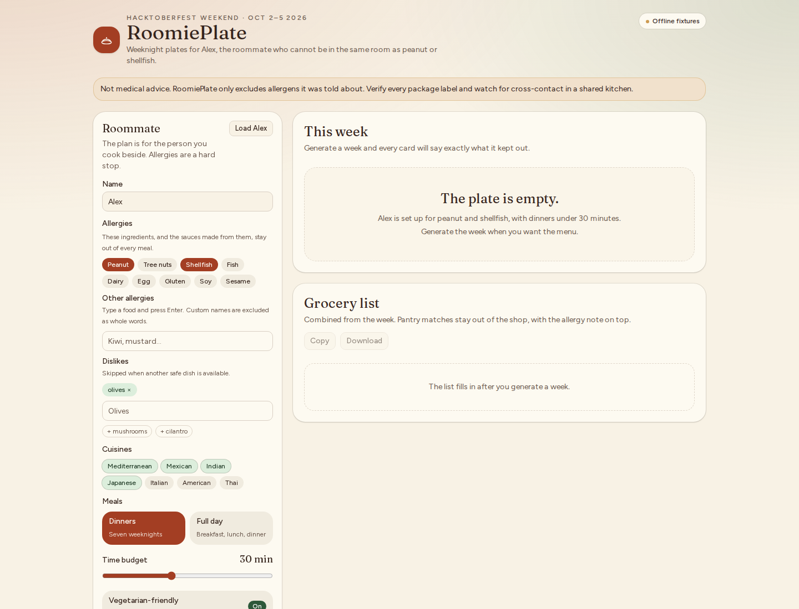

# RoomiePlate

RoomiePlate is a weeknight meal planner for the person you live with. It builds a week of meals that **hard-avoid** their allergies, then turns the plan into one grocery list.

The friend in this project is **Alex**: peanut and shellfish allergies, a preference for vegetarian dinners, and a 30-minute cap on weeknights. Those details are fiction for the demo. The rule is not: if an allergen is on the profile, it does not get a seat at the table.

This repo was started for the **Hacktoberfest Weekend Challenge, October 2–5, 2026**.

<!-- product-screenshots:start -->
## Product screenshots

Roommate profile and meal-planning workspace, including preferences, allergy controls, weekly meals, and groceries.



Existing UI capture stored in this repository; displayed values may be demo or sample data.
<!-- product-screenshots:end -->

## Who it is for

Shared kitchens fail in small, specific ways. Someone buys the wrong sauce, a “quick noodle” recipe hides peanut butter in step two, or Thursday’s dinner gets planned by whoever is hungriest. RoomiePlate is for the roommate who cooks and wants the constraint written down before the pan is hot.

It is a planning aid. It is **not medical advice**. The banner in the app says the same thing: verify labels, and assume a shared kitchen can still cross-contact a safe recipe.

## Why open models matter here

Allergy data is health data, even when it looks like a grocery note. RoomiePlate’s real planning path is a **local, open-weight model through [Ollama](https://ollama.com/)**:

- The app calls Ollama’s OpenAI-compatible API on your machine (`http://127.0.0.1:11434` by default).
- The default model is `gemma2:2b`. Set `OLLAMA_MODEL=llama3.2` (or any other local model) without changing the app.
- The dietary profile is sent to that local process, not to a hosted LLM vendor. Swap models, unplug the network, read the prompt in `src/lib/prompt.ts`.

A small model will sometimes ignore instructions. RoomiePlate does not trust the prose it gets back. `/api/plan` scans every title, ingredient, and step. If peanut, shellfish, or anything else on the profile shows up, that meal is thrown out. The “SAFE for Alex: no peanut/shellfish” line is written by the app, not the model.

### Offline fixtures

If Ollama is down, the model is missing, or the response is not a safe plan, RoomiePlate serves **offline fixtures**: deterministic recipes tagged and scanned the same way. The UI labels those cards **Offline fixture**. That path is what keeps a Vercel deploy usable without a GPU. It is the fallback. The product is the local model.

On a public deploy, the fixture planner still runs on the app server. For a private kitchen notebook, run RoomiePlate on your own computer.

## Run it

```bash
npm install
npm run dev
```

Open [http://127.0.0.1:43123](http://127.0.0.1:43123). Alex’s profile is already filled in. Choose **Plan Alex week**.

### With Ollama and Gemma

```bash
ollama pull gemma2:2b
ollama serve
```

In another terminal, from this repo:

```bash
npm run dev
```

Optional environment (see `.env.example`):

```bash
export OLLAMA_BASE_URL=http://127.0.0.1:11434
export OLLAMA_MODEL=gemma2:2b
# export OLLAMA_MODEL=llama3.2
```

The header pill says **Local gemma2:2b** when Ollama answers `/api/tags`, and **Offline fixtures** when it does not. Generating a week calls `POST /api/plan`, which builds a strict system prompt and asks the model for JSON.

Check the local engine without generating:

```bash
curl http://127.0.0.1:43123/api/status
```

Generate Alex’s dinners against whatever is running (Ollama if it is up, fixtures if it is not):

```bash
curl -s http://127.0.0.1:43123/api/plan \
  -H 'content-type: application/json' \
  -d '{"profile":{"name":"Alex","allergies":["peanut","shellfish"],"meals":"dinners","timeBudgetMinutes":30,"vegetarianFriendly":true,"cuisines":["Mediterranean","Mexican","Indian","Japanese"]},"pantry":["rice","lemon","garlic"],"scope":"week"}'
```

## What you can do in the app

1. Set the roommate: name, allergen chips, custom allergies, dislikes, cuisines, dinners or a full day, and a time budget.
2. Add pantry items you already have.
3. Generate the week. Each meal lists ingredients, steps, and the safety line.
4. Swap one meal or regenerate one day. The replacement is checked again.
5. Copy or download the grocery list. Amounts are combined. Pantry matches sit under “Already on hand,” and the allergy note stays at the top.

The profile, pantry, and plan are stored in this browser only (`localStorage`). There is no account and no database.

## Scripts

| Script | What it does |
| --- | --- |
| `npm run dev` | Next.js on port **43123** |
| `npm run build` | Production build |
| `npm run start` | Production server on port 43123 |
| `npm test` | Allergen, fixture, grocery, and prompt tests |
| `npm run lint` | ESLint |
| `npm run demo:screenshots` | Playwright shots into `docs/screenshots/` (app must already be running) |

No API keys. `.env.example` documents the Ollama variables. Do not commit a real `.env`.

## Demo notes

A click-through script for a write-up or a two-minute showing lives in [docs/demo-script.md](docs/demo-script.md). Screenshots from that path, when captured, live in `docs/screenshots/`.

## How the safety check works

- Known allergens (peanut, tree nuts, shellfish, fish, dairy, egg, gluten, soy, sesame) have keyword lists. Matching is on words, so eggplant is not an egg and coconut milk is not dairy.
- Custom allergies are whole words of at least three characters.
- Fixture recipes carry `contains` tags and are scanned again as text. A peanut satay fixture and a shrimp skillet exist in the catalog only so tests can prove they never reach Alex.
- Model output that fails the scan is replaced, meal by meal, with an offline fixture. If nothing safe survives, the whole week comes from fixtures.

## Layout

- `src/app/api/plan/route.ts` — `POST /api/plan`
- `src/app/api/status/route.ts` — local Ollama reachability
- `src/lib/prompt.ts` — system prompt
- `src/lib/ollama.ts` — OpenAI-compatible chat, then Ollama’s native `/api/chat`
- `src/lib/recipes.ts` — offline fixtures
- `src/lib/planner.ts` — deterministic week builder
- `openspec/` — the behavior spec for this planner

## Challenge window

Hacktoberfest Weekend Challenge, **October 2–5, 2026**. This project was started on October 2, 2026, as a from-scratch app: roommate allergy planning, with open-weight AI as the thing that makes the plan.
